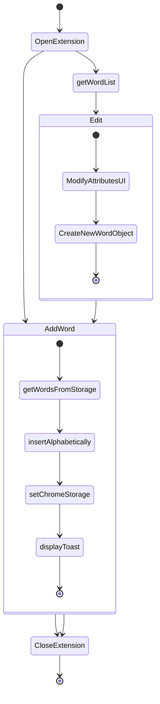

# Immerse

Immerse is a google chrome extension that replaces pieces of text on any web-page and adds a tooltip so you can see additional info if you need it. While this extension can be utilized for many different things, the UI focuses on using it for **language learning**.

### Author notes

I mainly use it for getting more Kanji in my day to day practice. So Japanese is the only language I'm actually trying to improve this extension for. That said, it should work for most other languages or filters fairly well.
I have been using this extension for personal use only since it requires unlimited DOM access to all visited websites. Chrome web store did not like that :P
I haven't done a clean install in a long time so feel free to create an Issue

### MVP

- ~~Works on any website~~ : Works on all elements discoverable by the DOM - no shadowDOM
- ~~Any of the words added to the extension will be replaced in the website~~: Usage works well when the source text is one word long. Can be iffy when theres spaces in the search text
- ~~Add, edit and delete words~~
- ~~Domain blacklist for sites that (AWS, DOCS, gov sites, etc)~~

### Installation

```
npm i
npm run build
```

- go to `chrome://extensions`
- enable developer mode
- Load Unpacked
- select the `./dist` folder

### Future Work

- Tooltip including additional dictionary data for different languages. (WIP)
- Add word with right click and get the 1st google translate option (WIP)
- Limit word field to not accept spaces (Weird behavior has been observerd when allowd to use)
- Analyze performance when word list gets into the 1000s
- Get a logo/designer help
- Get a more complete and robust JSON japanese to english dictionary
- Introduction workflow - Main language, what are you practicing?, etc
- Look into disabling replace on certain input elements like TextField, Input, TextArea, etc.

### Known Issues:

- Can tank performance on sites that dont use virtualization and render multiple components and update often. The script looks for words on the DOM every time the page is updated and replaces. so having multiple elements with constant updates is a bad recipe. -> If its a big issue look into adding the sites to the blacklist.
- Block domain requires page reload to stop the script from replacing words. Low priority right now but have thought of a fix.

### Far in the Future UI Updates

- Language Chooser: This could be a carrousel or a dropdown menu with the current language flag appearing on one of the edges
- Better list viewer and editor - Some ideas : Grid, maybe as-is but with multiple sorting options
- Fix font-sizes and general styling on the whole app
- Smart tooltip positioning instead of always to the bottom right
- Fix performance issue on SPAs after scrolling for long periods of time

### Typical actions

-- Mermaid can be visualized in VS code with an extension

#### Adding a new word to Immerse



## Old research

- Web component tooltip - droppped because of polyfills and chrome extensions(2018 last checked)
- Use API to get word details - No good ones were free (2018 last checked)

### Tech

- HTML, CSS, JS - basic for chrome extension
- StencilJs was chosen because I prefer pReact
- InjectionScript to replace thanks to: https://github.com/padolsey/findAndReplaceDOMText

### LICENSE

MIT License
