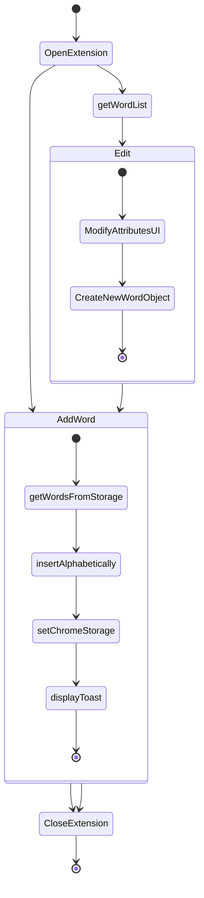

# Immerse!

Immerse is a google chrome extension that replaces pieces of text on any web-page and adds a tooltip so you can see additional info if you need it. While this extension can be used for many things, the UI focuses on utilizing it for **language learning**.

# Immerse(WIP)

## Tentative names

| name        | pros                           | cons              |
| ----------- | ------------------------------ | ----------------- |
| **Immerse** | Immerses you into the language | Hard to pronounce |
| LangBuddy   | a bit moredscriptive           | Sounds childish   |
|             |                                |                   |

### Main Features

- ~~Works on any website~~ : Works on components discoverable by the DOM - no shadowDOM
- ~~Any of the words added to the extension will be replaced in the website~~ - Have to be ONE word only - no spaces-
- ~~Add, edit and delete words~~
- Tooltip on such words with dictionary data. (WIP)
- ~~Domain blacklist for important sites(AWS, DOCS, gov sites, etc)~~

### OTHERS (TODO):

### UI Updates

- Language Chooser: This could be a carrousel or a dropdown menu with the current language flag appearing on one of the edges
- Better list viewer and editor - Some ideas : Grid, maybe as-is but with multiple sorting options
- Fix font-sizes on the whole app

### For Release

- Add word with right click and get the 1st google translate option
- Limit word field to not accept spaces
- Get logo, more professional design
- Get a more complete and robust JSON japanese to english dictionary
- Introduction workflow - Main language, what are you practicing, etc

### Future

- Smart tooltip positioning instead of always to the bottom right
- Fix performance issue on SPAs after scrolling for long periods of time

### Nice to haves

- ~~Export words and settings to CSV~~
- Have different sets for different languages
- Able to sync words between different computers with same google acc.
- Tooltip customization
- Firefox integration

## Diagrams

### Typical actions

#### Adding a new word to Immerse

#### Editing an existing word

## Old resources

- Web component tooltip - droppped because of polyfills and chrome extensions
- Use API to get words - none are free with as much use

### Tech

- HTML, CSS, JS - basic for chrome extension
- StencilJs was chosen because reasons
- That's pretty much it - just need to be creative
